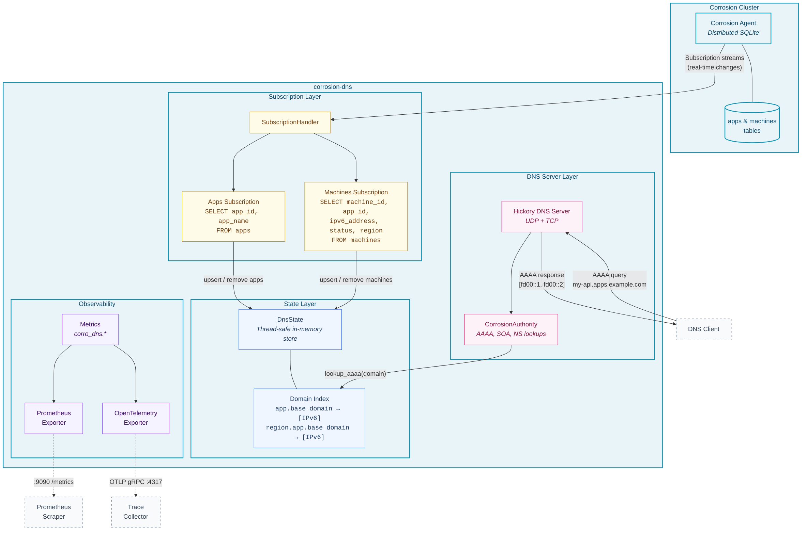
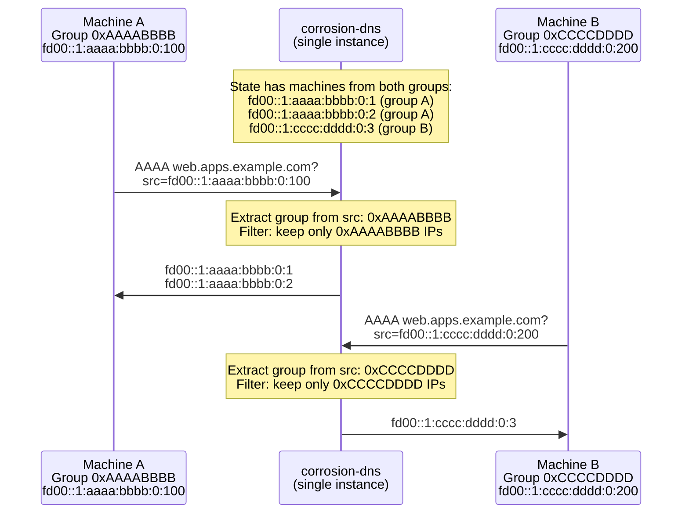
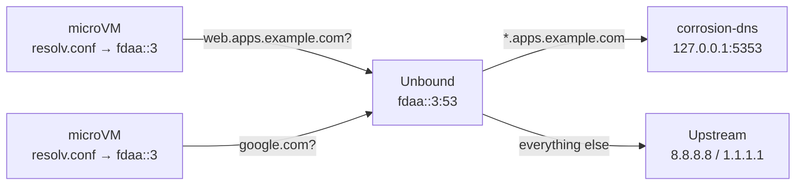

# corrosion-dns

[](https://github.com/iris-xyz/corrosion-dns/actions/workflows/ci.yml)
[](https://opensource.org/licenses/MIT)
[](https://www.rust-lang.org/)
[](Dockerfile)

An authoritative DNS server backed by [Corrosion](https://github.com/superfly/corrosion) distributed state. It subscribes to the `apps` and `machines` tables in a Corrosion cluster and serves real-time AAAA records based on running machine IPv6 addresses.

## Architecture



<details>
<summary>Mermaid source</summary>

See [`assets/architecture.mmd`](assets/architecture.mmd)
</details>

## Motivation

Platforms that host internal services on a private network need internal DNS so services can discover each other by name. The typical solution is a shared DNS server like [CoreDNS](https://coredns.io/) — you deploy one instance and every group on the cluster shares it. This works until you need **isolation** between groups (tenants, teams, environments). A single CoreDNS cannot isolate per-group: every querier can resolve names belonging to other groups.

The brute-force fix is deploying **N DNS servers for N groups**. That works but scales linearly in infrastructure.

corrosion-dns takes a different approach: **one instance, all groups, zero leakage**. It encodes a group identifier directly into the IPv6 addresses assigned to machines, then uses the querier's own source IP to decide which records they're allowed to see. A machine in group A queries the same DNS server as a machine in group B — but each only ever receives AAAA records matching its own group. The filtering happens at the IP level inside the DNS response, not through separate zones or server instances.

This makes it a good fit for:

- Multi-tenant platforms where each tenant needs isolated DNS without per-tenant infrastructure
- Internal service discovery within private networks
- Edge/regional deployments where machines come and go frequently
- Any system where DNS records should reflect the live state of running infrastructure and groups must not leak into each other

## Features

- Real-time DNS updates via Corrosion subscriptions
- AAAA records for app domains pointing to running machine IPv6 addresses
- **Source-IP group filtering** — one DNS instance isolates all groups
- Regional DNS lookups (`<region>.<app>.apps.example.com`)
- Automatic reconnection with exponential backoff
- Graceful shutdown support
- Prometheus metrics and optional OpenTelemetry tracing

## Group filtering

### The idea

Instead of running separate DNS servers per group, we embed a 32-bit group identifier directly into each machine's IPv6 address at a configurable bit range (bits 64-95 by default). When a DNS query arrives, corrosion-dns extracts the group hash from the **source IP** of the querier and compares it against the group hash in each candidate AAAA record. Only records with a matching group are returned. The querier never sees IPs belonging to other groups — isolation falls out of the address scheme, not from access control lists or separate server instances.

### How it works



### Requirements

The group filter doesn't assign addresses — it just reads them. Your infrastructure needs to:

1. **Embed a 32-bit group hash at bits 64-95** (default) of every machine's IPv6 address. The bit range is configurable via `group_start_bit` and `group_bit_length`. Use a stable hash (FNV-1a, xxHash, etc.) of the group identifier.

2. **Preserve real source IPs.** Group identity comes from the querier's source address — no NAT or proxies between machines and the DNS server.

### IPv4 bypass

IPv4 and IPv4-mapped IPv6 sources (e.g. `10.0.0.1`, `::ffff:10.0.0.1`) bypass the group filter entirely and receive all records. This is intentional — IPv4 sources don't carry group identity, so they're assumed to be infrastructure (load balancers, monitoring, etc.) that needs full visibility.

### Enabling it

Add the `group_filter` section to your config:

```toml
[dns.group_filter]
group_start_bit = 64   # where the group hash starts (0 = MSB)
group_bit_length = 32  # how many bits the group hash occupies
```

When this section is absent, all AAAA records are returned to all queriers (no filtering).

## Deployment with Unbound

corrosion-dns only serves its own zone (`apps.example.com`). If your microVMs point at a single DNS address for all resolution — internal apps and external names like `google.com` — you need a resolver in front that routes queries to the right place.

[Unbound](https://nlnetlabs.nl/projects/unbound/about/) does this. It sits at the WireGuard address your microVMs already use as their nameserver, forwards the internal zone to corrosion-dns, and resolves everything else upstream.



### Setup

1. **Install Unbound** on the host that runs corrosion-dns:

    ```bash
    # Debian/Ubuntu
    apt install unbound

    # Fedora
    dnf install unbound
    ```

2. **Copy the config** from this repo and edit the interface address and zone name:

    ```bash
    cp config/unbound.conf /etc/unbound/unbound.conf.d/corrosion-dns.conf
    ```

    Edit the file — change `fdaa::3` to your actual WireGuard address, `apps.example.com` to your base domain, and `127.0.0.1@5353` to wherever corrosion-dns is listening.

3. **Start both services:**

    ```bash
    # corrosion-dns serves the internal zone on localhost:5353
    corrosion-dns --config /etc/corrosion-dns/config.toml &

    # Unbound serves on the WireGuard address, forwarding internally
    systemctl enable --now unbound
    ```

4. **Point your microVMs** at the Unbound address:

    ```
    # /etc/resolv.conf inside each microVM
    nameserver fdaa::3
    ```

That's it. Internal names go through corrosion-dns with group filtering, external names go to upstream resolvers, and the microVM doesn't know the difference.

See [`config/unbound.conf`](config/unbound.conf) for the full annotated config.

## Quickstart

### Prerequisites

- Rust 1.75+ (2021 edition)
- A running [Corrosion](https://github.com/superfly/corrosion) agent with `apps` and `machines` tables
- **If using group filtering:** IPv6 addresses assigned to machines must carry a stable 32-bit group hash at bits 64-95 (configurable). Machines must query from their real IPv6 address — no NAT or proxies between the machine and the DNS server. See [Group filtering](#group-filtering) for details.

### Build and run

```bash
cargo build --release
./target/release/corrosion-dns --config corrosion-dns.example.toml
```

### With Docker

```bash
docker build -t corrosion-dns .
docker run -p 5353:5353/udp -p 5353:5353/tcp -p 9090:9090 \
  -v /path/to/config.toml:/etc/corrosion-dns/config.toml:ro \
  corrosion-dns
```

### With Docker Compose

The included `docker-compose.yml` brings up corrosion-dns alongside a Corrosion agent, with optional Jaeger and Prometheus/Grafana stacks:

```bash
# Core stack (Corrosion + DNS)
docker compose up

# With OpenTelemetry tracing
docker compose --profile otel up

# With Prometheus + Grafana monitoring
docker compose --profile monitoring up
```

## Configuration

corrosion-dns loads configuration from a TOML file and environment variables. Environment variables use the prefix `CORROSION_DNS__` with `__` as separator (e.g., `CORROSION_DNS__DNS__LISTEN_ADDR`).

See [`corrosion-dns.example.toml`](corrosion-dns.example.toml) for a fully commented example.

### Reference

| Key | Default | Description |
|-----|---------|-------------|
| `dns.listen_addr` | *(required)* | Address for DNS queries (UDP + TCP) |
| `dns.base_domain` | *(required)* | Base domain for apps (e.g., `apps.example.com`) |
| `dns.corrosion_addr` | *(required)* | Corrosion API address |
| `dns.ttl` | `60` | TTL for DNS records (seconds) |
| `dns.soa.mname` | `ns1.example.com` | Primary nameserver hostname |
| `dns.soa.rname` | `admin.example.com` | Admin email in DNS format |
| `dns.soa.refresh` | `3600` | SOA refresh interval (seconds) |
| `dns.soa.retry` | `600` | SOA retry interval (seconds) |
| `dns.soa.expire` | `604800` | SOA expire time (seconds) |
| `dns.soa.minimum` | `60` | SOA negative cache TTL (seconds) |
| `dns.group_filter.group_start_bit` | `64` | Bit offset (from MSB) where group hash starts |
| `dns.group_filter.group_bit_length` | `32` | Width of the group hash field in bits |
| `telemetry.log_level` | `info` | Log level filter (supports `RUST_LOG` syntax) |
| `telemetry.prometheus_addr` | *(disabled)* | Prometheus metrics endpoint address |
| `telemetry.opentelemetry.endpoint` | *(disabled)* | OTLP gRPC endpoint |
| `telemetry.opentelemetry.service_name` | `corrosion-dns` | Service name for traces |

## Development

```bash
# Run unit tests
cargo test --lib

# Run with clippy lints
cargo clippy --all-features -- -D warnings

# Check formatting
cargo fmt -- --check
```

### Cargo features

| Feature | Default | Description |
|---------|---------|-------------|
| `prometheus` | yes | Prometheus metrics exporter |
| `otel` | no | OpenTelemetry tracing via OTLP |

## Observability

### Metrics

All metrics are prefixed with `corro_dns.`. Key metrics:

| Metric | Type | Description |
|--------|------|-------------|
| `corro_dns.query.count` | Counter | DNS queries by `type` and `result` |
| `corro_dns.query.duration.seconds` | Histogram | Query latency by `type` |
| `corro_dns.query.aaaa.ips_returned` | Histogram | IPs returned per AAAA lookup |
| `corro_dns.state.apps.count` | Gauge | Number of tracked apps |
| `corro_dns.state.machines.count` | Gauge | Number of tracked machines |
| `corro_dns.state.machines.running` | Gauge | Running machines |
| `corro_dns.state.apps_ready` | Gauge | Apps subscription synced (0/1) |
| `corro_dns.state.machines_ready` | Gauge | Machines subscription synced (0/1) |
| `corro_dns.subscription.reconnect.count` | Counter | Subscription reconnects by `reason` |
| `corro_dns.state.resync.count` | Counter | Full state resyncs (missed changes) |

### Logging

Structured logging via `tracing`. Set the level with `telemetry.log_level` in config or the `RUST_LOG` environment variable.

## License

MIT
